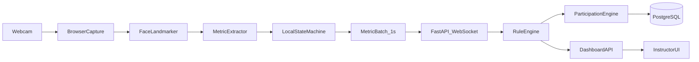
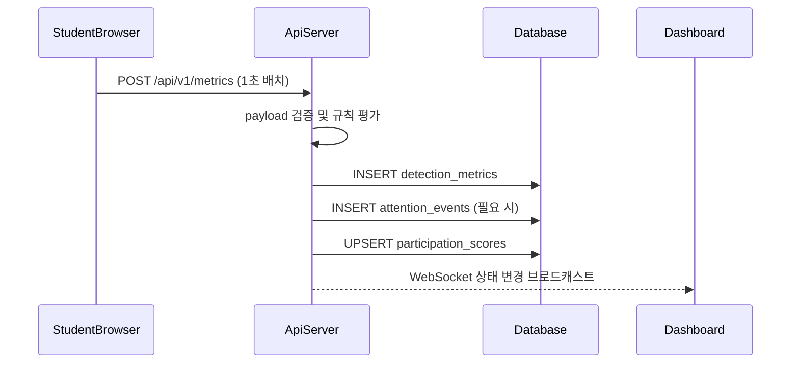

# FaceTrack 시선·졸음·자리이탈 재설계서

## 1. 문서 목적
이 문서는 기존 FaceTrack의 `자리 이탈 중심` 감지 구조를 `시선 감지`, `졸음 감지`, `자리 이탈 감지`를 모두 포함하는 집중도 모니터링 구조로 재설계하기 위한 목표 설계서다.

현재 구현은 `public/js/student.js` 에서 얼굴 검출, 자세 검출, 프레임 차이 기반 모션을 사용해 `present / warning / absent / idle` 상태를 계산하고, `server.js` 는 `Socket.IO` 이벤트를 메모리 `Map` 에만 저장한다. 따라서 다음 한계가 있다.

- 시선 이탈과 졸음 상태를 구분할 수 없다.
- 현재 참여율이 `자리 유지 시간` 중심이라 시선/졸음까지 반영한 참여 품질을 정밀하게 표현하지 못한다.
- 서버 재시작 시 데이터가 유실된다.
- 수업 종료 후 분석 가능한 이력 데이터가 부족하다.

본 설계는 이 한계를 해결하기 위해 `브라우저 1차 추론 + 서버 집계 + DB 영속화` 구조를 제안한다.

## 요구사항 기준 요약
이 설계서는 아래 4가지 요구사항을 기준으로 작성한다.

### 1. 시선감지·졸음감지·자리이탈감지 기준 정량화
- 자리 이탈 감지:
  - 기준: 얼굴이 실제로 웹캠 프레임 안에 포함되어 있는가
  - 정량 기준:
    - 얼굴 confidence `>= 0.70`
    - 얼굴 중심점이 프레임 내부
    - 얼굴 box 면적 비율 `>= 3%`
    - 위 조건을 만족한 프레임 비율이 최근 1초 기준 `>= 60%` 이면 `present`
    - 얼굴 미검출이 `1초 이상 5초 미만` 지속되면 `warning`
    - 얼굴 미검출이 `5초 이상` 지속되면 `absent`
- 시선 감지:
  - 기준: 고개 방향과 홍채 방향이 정면 집중 범위에 있는가
  - 정량 기준:
    - `|yaw| <= 20도`
    - `|pitch| <= 15도`
    - `|gazeOffsetX| <= 0.18`
    - `|gazeOffsetY| <= 0.20`
    - 기준 이탈이 `2초 이상 5초 미만` 이면 `look_away_short`
    - 기준 이탈이 `5초 이상` 이면 `look_away_long`
- 졸음 감지:
  - 기준: EAR 기반 눈 감김 지속 시간이 정상 blink 범위를 넘는가
  - 정량 기준:
    - `EAR < 0.21`
    - `0.10초 이상 0.40초 이하` 는 `blink`
    - `1.5초 이상 3초 미만` 은 `micro_sleep_warning`
    - `3초 이상` 은 `micro_sleep_risk`

### 2. 필요한 API와 기술
- 프론트엔드:
  - `React`
  - `Vite`
  - `navigator.mediaDevices.getUserMedia()`
  - `WebSocket`
- 브라우저 추론:
  - `MediaPipe Tasks Vision Face Landmarker`
  - 핵심 API:
    - `FilesetResolver.forVisionTasks()`
    - `FaceLandmarker.createFromOptions()`
    - `faceLandmarker.detectForVideo(video, timestamp)`
- 백엔드:
  - `FastAPI`
  - `Pydantic`
  - `WebSocket`
- DB:
  - `PostgreSQL`
  - 필요 시 `TimescaleDB`

### 3. 참여율 계산 공식
- 1분 평균 강도:
  - `avgAbsent = sumAbsent / N`
  - `avgGaze = sumGaze / N`
  - `avgDrowsy = sumDrowsy / N`
- 보조 지표:
  - `seatRate = (1 - avgAbsent) * 100`
  - `focusRate = max(0, 100 - avgGaze * 30)`
  - `alertRate = max(0, 100 - avgDrowsy * 20)`
- 최종 참여율:
  - `participationRate = clamp((100 - avgGaze * 30 - avgDrowsy * 20) * (1 - avgAbsent), 0, 100)`
- 표현 기준:
  - 최종 결과는 `등급` 이 아니라 `참여율(%)` 로 표현
  - 필요 시 화면에서만 `90% 이상`, `75% 이상` 같은 해석 구간을 보조 문구로 제공

### 4. DB에 데이터를 어떻게 넣는가
- 브라우저가 매초 요약 메트릭을 서버로 전송
- 서버는 검증 후 `detection_metrics` 에 원시 메트릭 저장
- 서버 규칙 엔진은 상태 전이를 감지해 `attention_events` 생성
- 서버 참여율 엔진은 최근 60초 및 세션 누적 참여율을 계산해 `participation_scores` 에 upsert
- 원본 영상은 저장하지 않고, 숫자형 메트릭과 이벤트만 저장

## 2. 목표
- 학생 브라우저에서 웹캠 프레임을 분석해 개인정보 노출을 최소화한다.
- 서버는 영상 원본이 아닌 특징값과 이벤트만 수집한다.
- 강사 화면은 실시간 상태와 누적 참여율을 모두 확인할 수 있어야 한다.
- DB에는 수업 종료 후 재분석 가능한 수준의 메트릭과 이벤트를 저장한다.
- 참여율은 `0~100(%)` 범위에서 일관되게 계산하고, 최근 60초와 세션 전체 두 관점으로 제공한다.
- 학생 앱과 강사 대시보드는 `React` 기반 프론트엔드로 구성한다.

## 3. 목표 아키텍처



### 3.1 처리 원칙
- 브라우저:
  - `React` 기반 학생 앱과 강사 대시보드 제공
  - 웹캠 접근
  - 얼굴 랜드마크 추론
  - EAR, 머리 방향, 시선 방향, 얼굴 존재 여부 같은 1차 특징값 계산
  - 1초 단위 배치 전송
- 서버:
  - 세션 인증 및 연결 관리
  - 이벤트 판정
  - 참여율 집계
  - 알림 브로드캐스트
- DB:
  - 메트릭 append-only 저장
  - 이벤트 로그 저장
  - 집계 참여율 upsert 저장

## 4. 감지 기준 정량화

### 4.1 공통 샘플링 규칙
- 브라우저 추론 주기: `5 FPS`
- 서버 전송 주기: `1초`
- 실시간 상태 판정 윈도우: 최근 `5초`
- 참여율 집계 윈도우: 최근 `60초`
- 세션 누적 참여율: 세션 시작 시점부터 현재까지

### 4.2 자리 이탈 감지
자리 이탈은 "얼굴이 웹캠 프레임 안에 유효하게 존재하는가"를 핵심 기준으로 잡고, 모호한 구간은 `warning` 으로 완충한다.

#### 4.2.1 유효 얼굴 조건
아래 조건을 모두 만족하면 `facePresent = true` 로 본다.

- 얼굴 검출 confidence `>= 0.70`
- 얼굴 bounding box 중심점 `0 <= cx <= 1`, `0 <= cy <= 1`
- 얼굴 box 면적 비율 `(w * h) >= 0.03`
- 랜드마크 추론 성공

#### 4.2.2 상태 정의
- `present`
  - 최근 1초 동안 유효 얼굴 검출 프레임 비율 `>= 0.6`
- `warning`
  - 유효 얼굴 검출 프레임 비율이 `0.2 이상 0.6 미만`
  - 또는 연속 얼굴 미검출 시간이 `1초 이상 5초 미만`
- `absent`
  - 연속 얼굴 미검출 시간이 `5초 이상`

#### 4.2.3 복귀 조건
- 아래 둘 중 하나를 만족하면 `absent -> present` 전이
  - 유효 얼굴 검출 `2프레임 연속 성공`
  - 최근 1초 동안 유효 얼굴 검출 프레임 비율 `>= 0.6`

#### 4.2.4 보조 예외 처리
- 카메라 차단 또는 손으로 렌즈를 가리는 경우:
  - `facePresent = false`
  - `occlusionScore >= 0.8` 이면 `absent` 대신 `camera_blocked` 이벤트도 함께 기록
- 네트워크 단절:
  - 브라우저 전송 누락 `>= 10초` 시 서버는 `offline` 상태로 분리

### 4.3 시선 감지
시선 감지는 얼굴 랜드마크와 홍채 중심을 이용해 머리 방향과 시선 중심 이탈을 함께 본다.

#### 4.3.1 입력 메트릭
- `yawDeg`: 좌우 머리 회전 각도
- `pitchDeg`: 상하 머리 회전 각도
- `rollDeg`: 기울기 보정용
- `gazeOffsetX`: 정면 대비 좌우 시선 편차
- `gazeOffsetY`: 정면 대비 상하 시선 편차

#### 4.3.2 집중 상태 기준
- `focused`
  - `|yawDeg| <= 20`
  - `|pitchDeg| <= 15`
  - `|gazeOffsetX| <= 0.18`
  - `|gazeOffsetY| <= 0.20`
- `look_away_short`
  - 위 기준 위반 상태가 `2초 이상 5초 미만`
- `look_away_long`
  - 위 기준 위반 상태가 `5초 이상`

#### 4.3.3 보정 규칙
- 얼굴이 없으면 시선 상태는 `unknown` 으로 두고 자리 이탈 규칙이 우선한다.
- 시선 상태는 한 프레임 값이 아니라 최근 `10프레임` 이동 평균으로 계산한다.
- 노트 필기처럼 짧게 아래를 보는 수업 패턴을 허용하기 위해:
  - `pitchDeg < -20` 이더라도 `3초 미만` 은 감점하지 않는다.

### 4.4 졸음 감지
졸음 감지는 눈 감김 지속 시간 중심으로 계산하고, 필요 시 하품 비율을 보조 지표로 사용한다.

#### 4.4.1 입력 메트릭
- `leftEar`
- `rightEar`
- `avgEar = (leftEar + rightEar) / 2`
- `mouthOpenRatio` 선택값

#### 4.4.2 상태 기준
- `blink`
  - `avgEar < 0.21` 상태가 `0.10초 이상 0.40초 이하`
- `micro_sleep_warning`
  - `avgEar < 0.21` 상태가 `1.5초 이상 3초 미만`
- `micro_sleep_risk`
  - `avgEar < 0.21` 상태가 `3초 이상`

#### 4.4.3 하품 보조 기준
- `yawn_detected`
  - `mouthOpenRatio >= 0.65` 상태가 `1.2초 이상`
- 하품은 단독으로 큰 감점 요인이 아니라 `졸음 위험도 보조 신호` 로만 사용한다.

#### 4.4.4 오탐 방지
- 안경 반사, 조도 급변, 얼굴 일부 가림이 감지되면 해당 초의 EAR 신뢰도를 낮춘다.
- EAR 신뢰도 `0.5 미만` 구간은 졸음 이벤트 생성에 직접 사용하지 않는다.

## 5. 상태 머신 설계

### 5.1 실시간 상태 우선순위
동시에 여러 징후가 발생했을 때 강사 화면 기본 상태는 아래 우선순위로 표현한다.

1. `offline`
2. `absent`
3. `drowsy_risk`
4. `look_away_long`
5. `warning`
6. `present`

### 5.2 상태 전이 규칙
- 얼굴 없음 `>= 5초` 이면 `absent`
- 얼굴 존재 + `micro_sleep_risk` 이면 `drowsy_risk`
- 얼굴 존재 + `look_away_long` 이면 `look_away_long`
- 얼굴 존재 + 짧은 시선 이탈 또는 짧은 폐안이면 `warning`
- 아무 이상 없음이면 `present`

## 6. 참여율 산식

### 6.1 참여율 원칙
- 참여율은 `0~100(%)` 범위 정수
- 최근 60초를 반영하는 `실시간 참여율`
- 수업 전체를 반영하는 `세션 누적 참여율`
- 자리 이탈을 가장 큰 저하 요인으로 둔다
- 등급은 저장하지 않고, 숫자형 참여율과 보조 지표만 저장한다

### 6.2 프레임 평균 강도 정의

#### 6.2.1 자리 이탈 평균 강도
최근 60초 프레임에서 계산한 자리 이탈 강도의 평균을 사용한다.

`avgAbsent = sumAbsent / N`

#### 6.2.2 시선 이탈 평균 강도
최근 60초 프레임에서 계산한 시선 이탈 강도의 평균을 사용한다.

`avgGaze = sumGaze / N`

#### 6.2.3 졸음 평균 강도
최근 60초 프레임에서 계산한 졸음 강도의 평균을 사용한다.

`avgDrowsy = sumDrowsy / N`

### 6.3 보조 참여율 지표
최종 참여율 외에도 원인 분석을 위해 아래 보조 지표를 함께 계산한다.

- `seatRate = (1 - avgAbsent) * 100`
- `focusRate = max(0, 100 - avgGaze * 30)`
- `alertRate = max(0, 100 - avgDrowsy * 20)`

설명:
- `seatRate`: 실제로 자리에 머무른 정도
- `focusRate`: 시선 기준 집중 유지 정도
- `alertRate`: 졸음 없이 각성을 유지한 정도

### 6.4 최종 참여율 공식
자리 유지가 참여의 전제 조건이므로, 시선/졸음으로 계산한 기본 참여 품질에 자리 유지 비율을 곱한다.

`participationRate = round(clamp((100 - avgGaze * 30 - avgDrowsy * 20) * (1 - avgAbsent), 0, 100))`

설명:
- 시선 이탈은 최대 `30%p` 저하
- 졸음은 최대 `20%p` 저하
- 자리 이탈은 마지막에 전체 참여율을 비율로 감소시킴

### 6.5 예시
- 최근 60초 기준
  - `avgAbsent = 0.344`
  - `avgGaze = 0.000`
  - `avgDrowsy = 0.000`

계산:

- `seatRate = (1 - 0.344) * 100 = 65.6`
- `focusRate = 100 - 0.000 * 30 = 100.0`
- `alertRate = 100 - 0.000 * 20 = 100.0`
- `participationRate = round(100 * (1 - 0.344)) = 66`

즉, 최종 결과는 `참여율 66%` 로 표현한다.

## 7. 필요한 API와 기술

### 7.1 브라우저 측 기술
- `React`
  - 학생용 추적 화면과 강사용 대시보드 UI 구성
  - 상태 변화에 따른 카드, 배지, 참여율 패널 렌더링
- `Vite`
  - React 프론트엔드 개발 서버 및 번들링
- `navigator.mediaDevices.getUserMedia()`
  - 웹캠 입력 수집
- `HTMLVideoElement`
  - `React ref` 로 비디오 스트림 렌더링
- `Canvas API`
  - `React ref` 기반 전처리, 디버그 오버레이, 캡처 보조
- `requestAnimationFrame` 또는 고정 주기 추론 루프
  - `custom hook` 내부에서 5 FPS 추론 제어
- `WebSocket`
  - 1초 단위 메트릭 업로드

권장 프론트 구조:
- `StudentApp`
  - 세션 입장, 웹캠 추적, 상태 표시
- `InstructorApp`
  - 실시간 학생 카드, 경고 패널, 참여율 현황
- `hooks/useCameraStream`
  - 카메라 스트림 연결과 종료
- `hooks/useAttentionInference`
  - Face Landmarker 추론, EAR 계산, 시선 계산
- `hooks/useSessionSocket`
  - WebSocket 연결, 재연결, 이벤트 수신

### 7.2 얼굴/시선/졸음 추론 기술
- `MediaPipe Tasks Vision Face Landmarker`
  - 얼굴 랜드마크
  - 홍채 위치
  - blendshape 기반 표정 보조값
  - 권장 설정:
    - `runningMode: "VIDEO"`
    - `numFaces: 1`
    - `outputFaceBlendshapes: true`
    - `outputFacialTransformationMatrixes: true`
  - 권장 호출 순서:
    - `FilesetResolver.forVisionTasks()`
    - `FaceLandmarker.createFromOptions()`
    - `faceLandmarker.detectForVideo(video, timestamp)`
- 보조 선택지
  - `TensorFlow.js`
  - `face-api.js`

권장 이유:
- 얼굴 box 검출만으로는 시선과 졸음을 판단하기 어렵다.
- Face Landmarker 는 EAR, 머리 방향, 시선 오프셋 계산에 필요한 랜드마크를 제공한다.
- `React` 환경에서도 `video` 와 `canvas` ref 를 통해 비교적 자연스럽게 통합할 수 있다.

### 7.3 서버 측 기술
- `FastAPI`
  - 세션/학생/대시보드 REST API
  - WebSocket 엔드포인트
- `Pydantic v2`
  - 메트릭 payload 검증
- `SQLAlchemy 2.0` 또는 `SQLModel`
  - DB 모델링
- `asyncpg`
  - PostgreSQL 비동기 드라이버
- `uvicorn`
  - 실행 서버

### 7.4 저장소 기술
- `PostgreSQL`
  - 정합성 있는 세션/학생/이벤트/참여율 저장
- 선택 사항: `TimescaleDB`
  - 장시간 시계열 조회 최적화가 필요할 때만 사용

### 7.5 대시보드 기술
- `React` 컴포넌트 기반 대시보드로 구현
- 학생 카드, 상태 배지, 참여율 차트, 경고 패널을 컴포넌트 단위로 분리
- 데이터 소스는 메모리 이벤트가 아니라 서버 집계 API와 WebSocket 브로드캐스트로 변경
- 권장 화면 구성:
  - `DashboardLayout`
  - `SessionHeader`
  - `StudentGrid`
  - `StudentCard`
  - `AlertPanel`
  - `ParticipationSummaryPanel`

## 8. API 설계

### 8.1 세션 생성
`POST /api/v1/sessions`

요청:

```json
{
  "instructorName": "홍길동",
  "title": "파이썬 기초 1주차"
}
```

응답:

```json
{
  "sessionId": "ses_01JT...",
  "sessionCode": "AB12C",
  "startedAt": "2026-05-12T03:00:00Z"
}
```

### 8.2 학생 입장 등록
`POST /api/v1/sessions/{sessionId}/participants`

요청:

```json
{
  "name": "김학생"
}
```

응답:

```json
{
  "participantId": "par_01JT...",
  "websocketToken": "jwt-or-session-token"
}
```

### 8.3 메트릭 업로드
`POST /api/v1/metrics`

설명:
- 학생 브라우저가 `1초` 단위로 전송
- 원본 프레임은 보내지 않음
- 서버는 입력 검증 후 `detection_metrics` 저장

요청:

```json
{
  "sessionId": "ses_01JT...",
  "participantId": "par_01JT...",
  "capturedAt": "2026-05-12T03:10:15Z",
  "sampleFps": 5,
  "facePresentRatio": 0.8,
  "faceConfidenceAvg": 0.91,
  "yawDegAvg": 7.4,
  "pitchDegAvg": -4.8,
  "gazeOffsetXAvg": 0.09,
  "gazeOffsetYAvg": 0.12,
  "avgEar": 0.24,
  "blinkCount": 1,
  "eyesClosedMs": 0,
  "lookAwayMs": 600,
  "occlusionScore": 0.05,
  "cameraBlocked": false
}
```

응답:

```json
{
  "accepted": true,
  "serverTs": "2026-05-12T03:10:15.220Z"
}
```

### 8.4 고수준 이벤트 저장
`POST /api/v1/events`

설명:
- 이벤트는 클라이언트가 직접 보내기보다 서버 규칙 엔진이 생성하는 것을 권장
- 다만 재처리나 관리자 입력을 위해 API는 유지 가능

요청:

```json
{
  "sessionId": "ses_01JT...",
  "participantId": "par_01JT...",
  "eventType": "ABSENT_START",
  "startedAt": "2026-05-12T03:12:00Z",
  "endedAt": null,
  "durationMs": null,
  "confidence": 0.96,
  "meta": {
    "reason": "face_missing_5s"
  }
}
```

### 8.5 강사용 대시보드 조회
`GET /api/v1/sessions/{sessionId}/dashboard`

응답 필드:
- 세션 전체 평균 참여율
- 현재 `absent`, `look_away_long`, `drowsy_risk` 학생 수
- 학생별 최근 상태, 최근 60초 참여율, 누적 참여율, 마지막 이벤트

### 8.6 실시간 브로드캐스트
`GET /ws/sessions/{sessionId}`

서버 이벤트 예시:

```json
{
  "type": "participant_status_changed",
  "sessionId": "ses_01JT...",
  "participantId": "par_01JT...",
  "status": "drowsy_risk",
  "realtimeParticipationRate": 58,
  "eventTs": "2026-05-12T03:15:33Z"
}
```

## 9. DB 설계

### 9.1 테이블 개요
- `sessions`
- `participants`
- `detection_metrics`
- `attention_events`
- `participation_scores`

### 9.2 sessions
수업 세션 기본 정보 저장

| 컬럼 | 타입 | 설명 |
| --- | --- | --- |
| `id` | `uuid` | PK |
| `session_code` | `varchar(12)` | 학생 입장 코드 |
| `title` | `varchar(100)` | 수업명 |
| `instructor_name` | `varchar(50)` | 강사명 |
| `started_at` | `timestamptz` | 시작 시각 |
| `ended_at` | `timestamptz` | 종료 시각 |
| `status` | `varchar(20)` | `active`, `ended` |

### 9.3 participants
학생 기본 정보 및 세션 참여 정보 저장

| 컬럼 | 타입 | 설명 |
| --- | --- | --- |
| `id` | `uuid` | PK |
| `session_id` | `uuid` | FK to `sessions.id` |
| `name` | `varchar(50)` | 학생명 |
| `joined_at` | `timestamptz` | 입장 시각 |
| `left_at` | `timestamptz` | 퇴장 시각 |
| `status` | `varchar(20)` | 현재 상태 |

### 9.4 detection_metrics
1초 단위 원시 메트릭 저장

| 컬럼 | 타입 | 설명 |
| --- | --- | --- |
| `id` | `bigserial` | PK |
| `session_id` | `uuid` | FK |
| `participant_id` | `uuid` | FK |
| `captured_at` | `timestamptz` | 메트릭 시각 |
| `sample_fps` | `smallint` | 초당 샘플 프레임 수 |
| `face_present_ratio` | `numeric(4,3)` | 얼굴 존재 프레임 비율 |
| `face_confidence_avg` | `numeric(4,3)` | 얼굴 confidence 평균 |
| `yaw_deg_avg` | `numeric(5,2)` | 평균 yaw |
| `pitch_deg_avg` | `numeric(5,2)` | 평균 pitch |
| `gaze_offset_x_avg` | `numeric(5,3)` | 평균 좌우 시선 편차 |
| `gaze_offset_y_avg` | `numeric(5,3)` | 평균 상하 시선 편차 |
| `avg_ear` | `numeric(5,3)` | 평균 EAR |
| `blink_count` | `smallint` | 1초 내 blink 횟수 |
| `eyes_closed_ms` | `integer` | 1초 내 폐안 누적 시간 |
| `look_away_ms` | `integer` | 1초 내 시선 이탈 누적 시간 |
| `occlusion_score` | `numeric(4,3)` | 가림 정도 |
| `camera_blocked` | `boolean` | 렌즈 가림 여부 |
| `created_at` | `timestamptz` | 적재 시각 |

권장 인덱스:
- `(session_id, participant_id, captured_at desc)`
- `(participant_id, captured_at desc)`

### 9.5 attention_events
상태 전이 이벤트 저장

| 컬럼 | 타입 | 설명 |
| --- | --- | --- |
| `id` | `uuid` | PK |
| `session_id` | `uuid` | FK |
| `participant_id` | `uuid` | FK |
| `event_type` | `varchar(40)` | `ABSENT_START`, `ABSENT_END`, `LOOK_AWAY_LONG`, `MICRO_SLEEP_RISK` 등 |
| `started_at` | `timestamptz` | 이벤트 시작 |
| `ended_at` | `timestamptz` | 이벤트 종료 |
| `duration_ms` | `integer` | 지속 시간 |
| `confidence` | `numeric(4,3)` | 이벤트 신뢰도 |
| `meta_json` | `jsonb` | 원인, 세부 지표 |
| `created_at` | `timestamptz` | 적재 시각 |

### 9.6 participation_scores
집계 참여율 저장

| 컬럼 | 타입 | 설명 |
| --- | --- | --- |
| `id` | `bigserial` | PK |
| `session_id` | `uuid` | FK |
| `participant_id` | `uuid` | FK |
| `window_started_at` | `timestamptz` | 집계 시작 |
| `window_ended_at` | `timestamptz` | 집계 종료 |
| `participation_scope` | `varchar(20)` | `realtime_60s`, `session_total` |
| `participation_rate` | `smallint` | 0~100 |
| `seat_rate` | `smallint` | 0~100 |
| `focus_rate` | `smallint` | 0~100 |
| `alert_rate` | `smallint` | 0~100 |
| `avg_absent` | `numeric(4,3)` | 0.000~1.000 |
| `avg_gaze` | `numeric(4,3)` | 0.000~1.000 |
| `avg_drowsy` | `numeric(4,3)` | 0.000~1.000 |
| `created_at` | `timestamptz` | 적재 시각 |
| `updated_at` | `timestamptz` | 갱신 시각 |

권장 제약:
- `unique(session_id, participant_id, window_started_at, window_ended_at, participation_scope)`

## 10. DB에 데이터를 넣는 방식

### 10.1 적재 흐름



### 10.2 저장 원칙
- `detection_metrics`
  - append-only
  - 1초마다 한 행
- `attention_events`
  - 상태 전이가 발생했을 때만 저장
  - 예: 자리 이탈 시작, 자리 복귀, 긴 시선 이탈, 졸음 위험
- `participation_scores`
  - 최근 60초 참여율은 `upsert`
  - 세션 누적 참여율도 주기적으로 `upsert`

### 10.3 예시 SQL 흐름

```sql
INSERT INTO detection_metrics (
  session_id,
  participant_id,
  captured_at,
  sample_fps,
  face_present_ratio,
  face_confidence_avg,
  yaw_deg_avg,
  pitch_deg_avg,
  gaze_offset_x_avg,
  gaze_offset_y_avg,
  avg_ear,
  blink_count,
  eyes_closed_ms,
  look_away_ms,
  occlusion_score,
  camera_blocked,
  created_at
) VALUES (
  :session_id,
  :participant_id,
  :captured_at,
  :sample_fps,
  :face_present_ratio,
  :face_confidence_avg,
  :yaw_deg_avg,
  :pitch_deg_avg,
  :gaze_offset_x_avg,
  :gaze_offset_y_avg,
  :avg_ear,
  :blink_count,
  :eyes_closed_ms,
  :look_away_ms,
  :occlusion_score,
  :camera_blocked,
  NOW()
);
```

```sql
INSERT INTO participation_scores (
  session_id,
  participant_id,
  window_started_at,
  window_ended_at,
  participation_scope,
  participation_rate,
  seat_rate,
  focus_rate,
  alert_rate,
  avg_absent,
  avg_gaze,
  avg_drowsy,
  created_at,
  updated_at
) VALUES (
  :session_id,
  :participant_id,
  :window_started_at,
  :window_ended_at,
  :participation_scope,
  :participation_rate,
  :seat_rate,
  :focus_rate,
  :alert_rate,
  :avg_absent,
  :avg_gaze,
  :avg_drowsy,
  NOW(),
  NOW()
)
ON CONFLICT (session_id, participant_id, window_started_at, window_ended_at, participation_scope)
DO UPDATE SET
  participation_rate = EXCLUDED.participation_rate,
  seat_rate = EXCLUDED.seat_rate,
  focus_rate = EXCLUDED.focus_rate,
  alert_rate = EXCLUDED.alert_rate,
  avg_absent = EXCLUDED.avg_absent,
  avg_gaze = EXCLUDED.avg_gaze,
  avg_drowsy = EXCLUDED.avg_drowsy,
  updated_at = NOW();
```

## 11. 운영 및 보안 고려사항
- 원본 영상은 저장하지 않는다.
- 브라우저에서 특징값만 계산해 전송한다.
- 세션/학생 식별자는 UUID 기반으로 관리한다.
- WebSocket 연결에는 세션 토큰을 사용한다.
- API 입력값은 모두 서버에서 재검증한다.
- 랜드마크 실패, 조도 급변, 카메라 차단은 `meta_json` 으로 남겨 추후 오탐 분석에 사용한다.

## 12. 기존 구현 대비 변경 요약
- 기존:
  - 얼굴 검출 + 자세 + 모션으로 자리 이탈만 중심 판단
  - Socket.IO 기반 메모리 저장
  - 단순 참여 시간 중심 참여율
- 재설계:
  - `React` 기반 학생 앱과 강사 대시보드 도입
  - Face Landmarker 기반 시선/졸음/자리 이탈 통합 감지
  - FastAPI + PostgreSQL 기반 영속화
  - 메트릭, 이벤트, 참여율 분리 저장
  - 최근 60초 참여율과 세션 누적 참여율 병행 제공

## 13. 권장 구현 순서
1. 브라우저에 Face Landmarker 기반 메트릭 추출기 추가
2. FastAPI 세션/학생/메트릭 API 구축
3. PostgreSQL 스키마 생성
4. 규칙 엔진으로 이벤트 판정 구현
5. 참여율 엔진으로 60초 참여율과 누적 참여율 계산
6. 강사 대시보드를 새 API 기반으로 전환

## 14. 최종 결론
이 재설계의 핵심은 `영상 자체를 서버로 보내지 않고`, 브라우저가 계산한 `정량 메트릭` 만 서버에 전송한 뒤, 서버가 이를 기반으로 이벤트와 참여율을 계산해 DB에 저장하는 것이다. 이렇게 하면 개인정보 노출을 최소화하면서도, 시선 이탈, 졸음, 자리 이탈을 각각 분리해 해석할 수 있고, 수업 후에도 재분석 가능한 데이터 구조를 확보할 수 있다.
